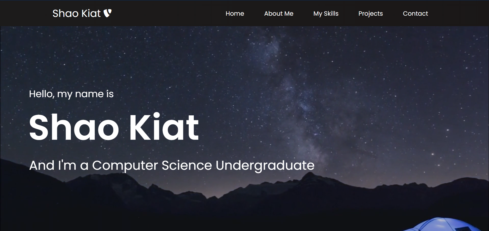

# Shao Kiat's Personal Portfolio Website

## About

This is a self-initiated project to learn how to build a website using React.js and CSS.

Started on year 2 winter break Dec 2020

Link to the setup [Guide](https://github.com/shaokiat/personal-portfolio/blob/main/guide.md)

Deployed on Heroku

## Resources referenced

React Website Tutorial by  
[Brian Design](https://www.youtube.com/watch?v=I2UBjN5ER4s)

Responsive Personal Portfolio Website using HTML CSS & JavaScript by  
[Coding Nepal](https://www.youtube.com/watch?v=tcskp-ncN0I)
